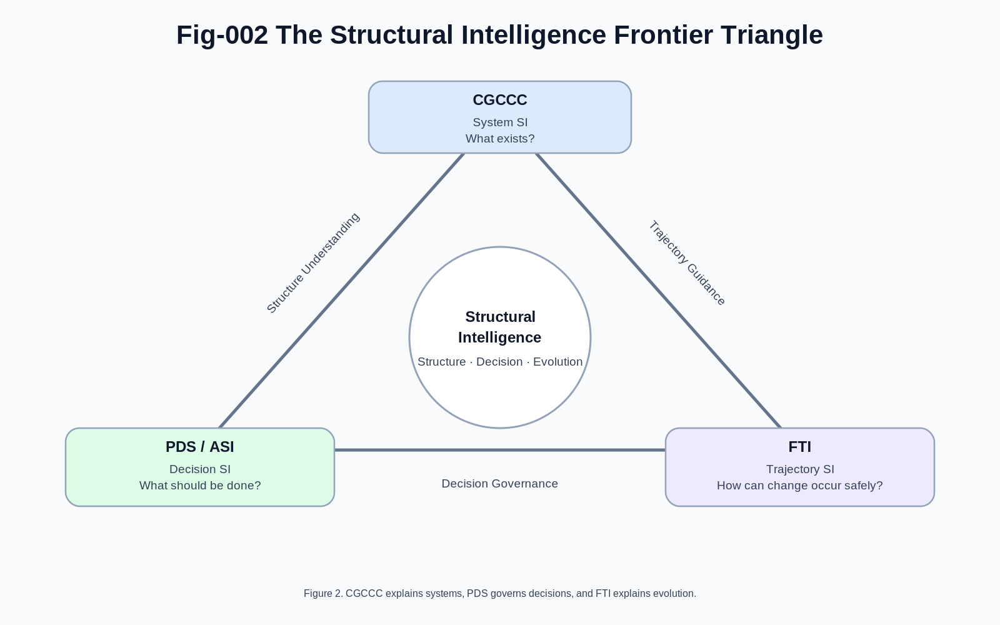
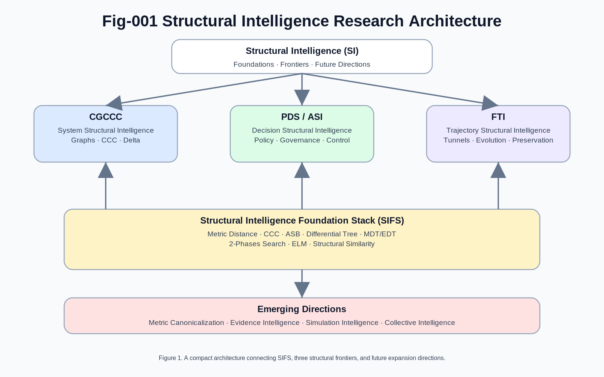
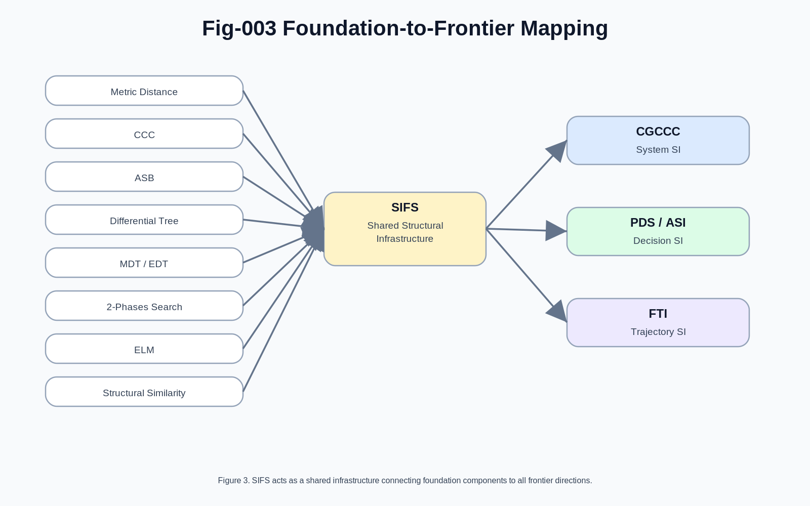
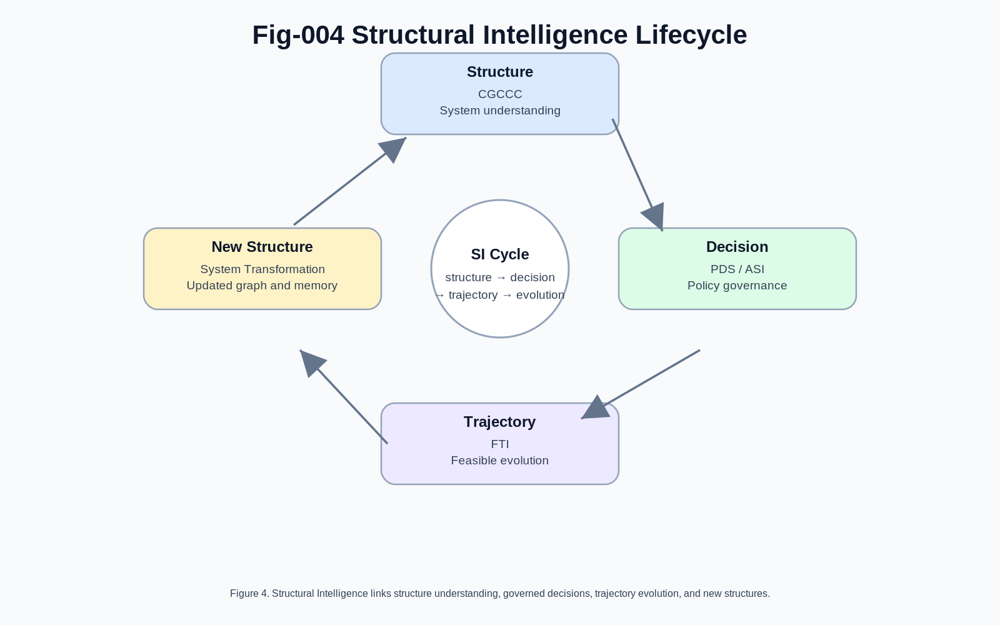
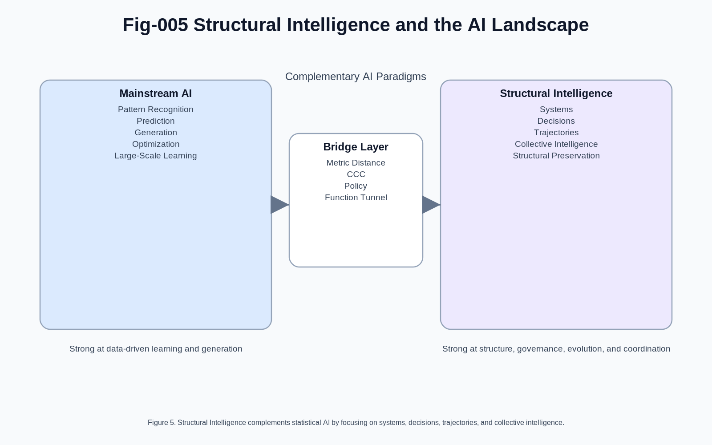

# Structural Intelligence: Foundations, Frontiers, and Future Directions
## A Unified Research Map for Next-Generation AI

## Abstract

Artificial Intelligence has achieved remarkable success through statistical learning, large-scale optimization, and generative modeling. However, many fundamental challenges remain unresolved, including structural understanding, long-horizon decision making, explainability, trajectory preservation, system-level governance, and collective intelligence.

This document presents a unified research map developed through the Structural Intelligence (SI) framework. The framework organizes the field into three major frontier directions supported by a common foundation stack and extended by several emerging research directions.

The objective is not to replace existing AI paradigms, but to provide a structural layer that complements statistical learning and enables the development of more reliable, interpretable, governable, and evolvable intelligent systems.

## 1. Introduction

Most current AI systems are optimized to answer questions, generate content, predict outcomes, or maximize reward functions.

Structural Intelligence begins from a different perspective:

> Intelligence is not merely the ability to generate outputs.

> Intelligence is the ability to understand structures, make decisions within structures, and evolve along feasible trajectories while preserving essential functionality.

From this perspective, three fundamental questions emerge:

#### System Question

How are complex systems organized and evolved?

#### Decision Question

How are actions selected and governed?

#### Trajectory Question

How do systems evolve while preserving critical functionality?

These three questions define the three frontier directions of Structural Intelligence:

- CGCCC (System Structural Intelligence)
- PDS/ASI (Decision Structural Intelligence)
- FTI (Trajectory Structural Intelligence)

---

---

Together they form the primary research frontiers built upon a shared mathematical and computational foundation.

## 2. Structural Intelligence Research Architecture

---

---

    ====================================================
    
               Structural Intelligence (SI)
    
    ====================================================
    
          Frontier-A      Frontier-B      Frontier-C
    
             CGCCC          PDS/ASI           FTI
    
          System SI      Decision SI    Trajectory SI
    
    ====================================================
    
          Common Foundation Layer (SIFS)
    
    ----------------------------------------------------
    
          Metric Distance
    
          CCC
    
          Automatic Segmenting and Branching (ASB)
    
          Differential Tree
    
          MDT / EDT
    
          2-Phases Search
    
          ELM
    
          Structural Similarity
    
    ====================================================
    
          Emerging Directions
    
    ----------------------------------------------------
    
          Metric Canonicalization
    
          Evidence Intelligence
    
          Simulation Intelligence
    
          Collective Intelligence
    
    ====================================================

This architecture separates the field into three layers:

1. Foundations
2. Frontier Research Directions
3. Future Expansion Directions

## 3. Structural Intelligence Foundation Stack (SIFS)

The Structural Intelligence Foundation Stack provides the common infrastructure shared by all higher-level Structural Intelligence systems.

---

---

### 3.1 Metric Distance

Metric Distance serves as the measurement engine of Structural Intelligence.

Every intelligent system must answer:

- What is similar?
- What is different?
- How different?
- In which direction?

Metric Distance provides the quantitative basis for these questions.

Unlike traditional similarity metrics used only for retrieval, Structural Intelligence treats distance as a first-class operational primitive for decision making, navigation, clustering, governance, and evolution.

### 3.2 Common Concept Core (CCC)

CCC represents the shared invariant structure among multiple observations.

Rather than focusing solely on differences, CCC focuses on discovering common structural cores.

CCC enables:

- abstraction
- compression
- generalization
- transfer learning
- policy preservation

CCC acts as the structural anchor throughout the SI ecosystem.

### 3.3 Automatic Segmenting and Branching (ASB)

Many natural and artificial systems contain hidden segmentation and branching structures.

ASB provides mechanisms for automatically discovering:

- states
- phases
- transitions
- branches
- sub-processes

ASB plays a role similar to feature extraction in machine learning but operates directly on structural and temporal organization.

ASB is expected to become increasingly important for:

- trajectory discovery
- process mining
- behavior decomposition
- autonomous knowledge construction

### 3.4 Differential Trees

Differential Trees provide hierarchical structural partitioning.

Instead of organizing data by exact values, Differential Trees organize data by differences.

This supports:

- scalable search
- hierarchical abstraction
- dynamic clustering
-structural navigation

Differential Trees serve as one of the fundamental organizational structures of SI.

### 3.5 MDT and EDT

Metric Differential Trees (MDT) and Euclidean Differential Trees (EDT) extend Differential Trees into metric and geometric domains.

These structures provide:

- efficient indexing
- scalable navigation
- hierarchical clustering
- structural retrieval

They form the backbone of large-scale structural memory systems.

### 3.6 Two-Phases Search

Two-Phases Search separates retrieval into:

#### Phase 1

Fast coarse candidate discovery.

#### Phase 2

Accurate metric evaluation.

This architecture balances:

- efficiency
- scalability
- precision

and appears repeatedly across SI systems.

### 3.7 Event Language Models (ELM)

ELM extends intelligence from static representations toward event-centric reasoning.

Instead of modeling isolated states, ELM models:

- events
- transitions
- temporal evolution

ELM provides an important bridge between structural memory and trajectory intelligence.

### 3.8 Structural Similarity

Structural Similarity focuses on relationships rather than appearances.

Two objects may look different while sharing the same structural organization.

This principle is essential for:

- abstraction
- transfer
- generalization
- policy preservation

and serves as a recurring theme throughout Structural Intelligence.

## 4. Frontier A: CGCCC
System Structural Intelligence

CGCCC evolves from:

    Calling Graph
    → Calling Graph CCC
    → CGCCC for AI Coding
    → Task-Action Dual Calling Graphs
    → Future Networked Intelligence

CGCCC focuses on:

- systems
- organizations
- workflows
- software
- civilization-scale networks

Its central question is:

> How are complex systems organized and evolved?

Core concepts include:

- Calling Graphs
- CCC extraction
- Delta evolution
- Task-Action duality
- structural governance

CGCCC can be viewed as the System Structural Intelligence branch of SI.

## 5. Frontier B: PDS / ASI

### Decision Structural Intelligence

PDS evolves through:

    Policy Decision System
    → Structural Intelligence Control Plane
    → PDS General Algorithmic Form
    → CCC Mathematics
    → Autonomous Structural Intelligence

PDS focuses on:

- decision making
- policy selection
- governance
- runtime control
- explainability

Its central question is:

> How should intelligent systems choose actions?

Key concepts include:

- Policy
- Decision Surface
- Structural Governance
- Runtime Control
- Autonomous Decision Systems

PDS acts as the operational control plane of Structural Intelligence.

## 6. Frontier C: FTI
Trajectory Structural Intelligence

FTI evolves through:

    Trajectory Intelligence
    → Function-Tunnel Intelligence
    → Generalized Function-Tunnel Intelligence

FTI focuses on:

- trajectories
- evolution
- transformation
- preservation
- feasible derivation

Its central question is:

> How can systems evolve while preserving critical functionality?

Key concepts include:

- Function Tunnels
- Trajectory IR
- CCC-Preserved Derivation
- Evolution Constraints
- Functional Preservation

FTI represents the Trajectory Structural Intelligence branch of SI.

## 7. Relationships Between the Three Frontiers

The three frontier directions are complementary rather than competing.

### CGCCC

Focuses on system structures.

Answers:

> What exists?

### PDS

Focuses on decisions.

Answers:

> What should be done?

### FTI

Focuses on evolution.

Answers:

> How can change occur safely?

Together they provide a complete structural reasoning cycle:

    System
       ↓
    
    Decision
    
       ↓
    
    Trajectory
    
       ↓
    
    System Evolution

---

---

## 8. Emerging Research Directions

Several important directions remain only partially explored.

These directions may define future generations of Structural Intelligence research.

### 8.1 Metric Canonicalization

Fundamental questions remain:

- What is distance?
- What is similarity?
- What is structural deviation?

A unified metric theory may become one of the most important mathematical foundations of future SI systems.

### 8.2 Evidence Intelligence

Modern AI often provides answers without explicit evidence chains.

Future systems must support:

- evidence tracing
- explanation
- justification
- provenance

Evidence Intelligence seeks to answer:

> Why was this decision made?

### 8.3 Simulation Intelligence

Many decisions cannot be validated directly.

Simulation Intelligence provides:

- what-if analysis
- scenario exploration
- policy evaluation
- trajectory testing

This direction is expected to become increasingly important for ASI and FTI.

### 8.4 Collective Intelligence

Future intelligence may not reside within a single model.

Instead, it may emerge from:

- humans
- AI agents
- organizations
- networks

Collective Intelligence investigates how large-scale intelligence ecosystems can coordinate, evolve, and self-govern.

This direction naturally connects to Future Networked Intelligence (FNI).

---

---

## 9. Conclusion

Structural Intelligence can be viewed as a unified research program composed of:

### Foundations

The Structural Intelligence Foundation Stack (SIFS)

### Frontiers
- CGCCC (System Structural Intelligence)
- PDS/ASI (Decision Structural Intelligence)
- FTI (Trajectory Structural Intelligence)

### Future Directions
- Metric Canonicalization
- Evidence Intelligence
- Simulation Intelligence
- Collective Intelligence

Together these components provide a coherent framework for studying intelligence beyond pure statistical prediction.

The long-term vision is not merely to build systems that generate outputs, but to build systems that understand structures, govern decisions, preserve functionality, and participate in the evolution of increasingly complex human-AI ecosystems.

**Structural Intelligence Research Program**

**Foundations → Decisions → Systems → Trajectories → Collective Evolution**

A roadmap toward the next generation of intelligent systems.